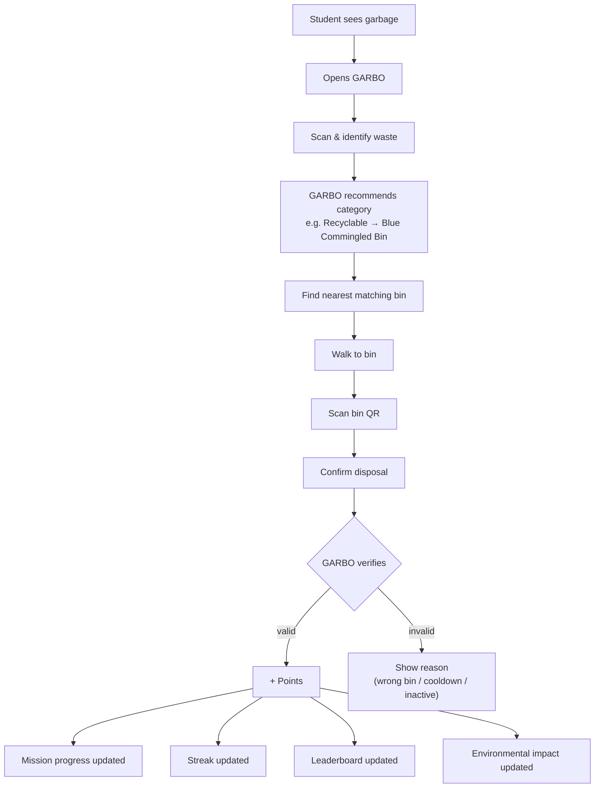
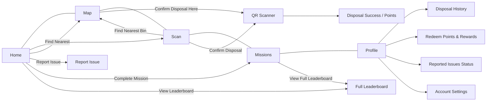
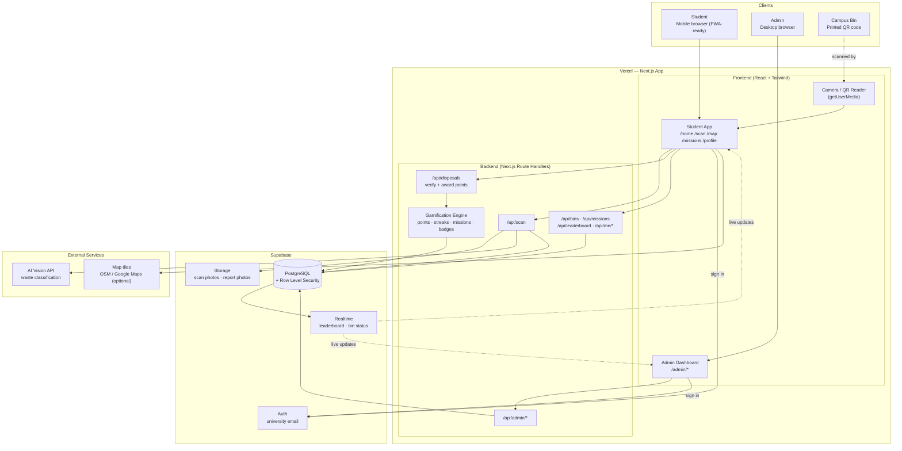
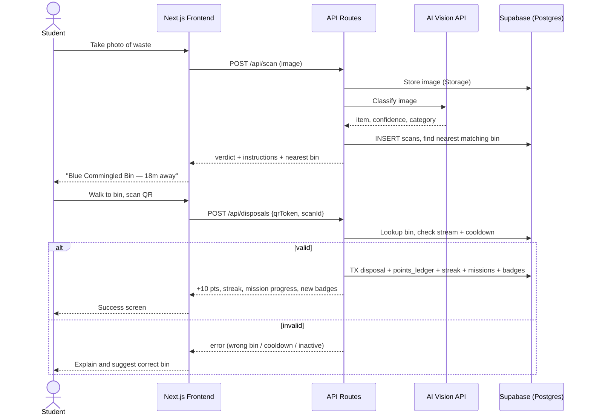
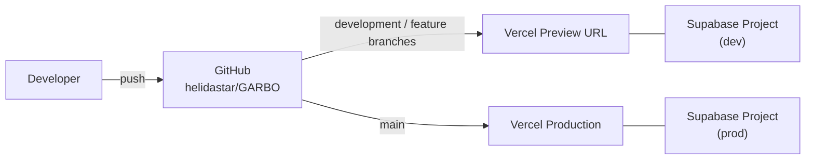
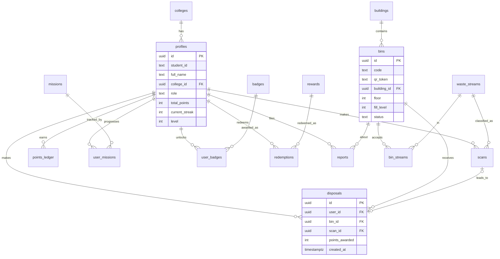

# GARBO 2.0 — Project Documentation

> **Status:** Blueprint / planning stage. No app code has been written yet. Everything marked *(planned)* describes the intended design, taken from the Figma file [Revised GARBO](https://www.figma.com/design/Fb0rUK6U9Yg9cJtkOQCt3F/Revised-GARBO?node-id=0-1).
> Each screen in Section 5 links directly to its Figma frame.

## Table of Contents
1. [Feature Information](#1-feature-information)
2. [Project Information](#2-project-information)
3. [Overview](#3-overview)
4. [User Flow](#4-user-flow)
5. [User Interface & Features Breakdown](#5-user-interface--features-breakdown)
6. [Core Concepts](#6-core-concepts)
7. [System Architecture](#7-system-architecture)
8. [Design System](#8-design-system)
9. [Data Model](#9-data-model)
10. [API Endpoints](#10-api-endpoints)
11. [Data Sources & Seeding](#11-data-sources--seeding)
12. [Frontend Architecture](#12-frontend-architecture)
13. [Backend Implementation](#13-backend-implementation)
14. [Setup & Configuration](#14-setup--configuration)
15. [Common Tasks](#15-common-tasks)
16. [Known Issues, Caveats & Open Questions](#16-known-issues-caveats--open-questions)
17. [Quick Reference for the Next Developer](#17-quick-reference-for-the-next-developer)
18. [Appendix A — Future Enhancements](#appendix-a--future-enhancements)
19. [Appendix B — Documentation Checklist](#appendix-b--documentation-checklist)

---

## 1. Feature Information

| Field | Value |
|-------|-------|
| **Feature / Product** | GARBO 2.0 — Campus Waste Management & Student Engagement |
| **Type** | Mobile-first web app (student) + desktop admin dashboard |
| **Status** | Blueprint (5 student screens designed in Figma) |
| **Primary users** | University students |
| **Secondary users** | University admins / facilities staff |
| **Design source** | [Figma — Revised GARBO](https://www.figma.com/design/Fb0rUK6U9Yg9cJtkOQCt3F/Revised-GARBO?node-id=0-1) |
| **Frontend** | Next.js (React) + Tailwind CSS |
| **Backend** | Next.js Route Handlers (Node.js) |
| **Database / Auth** | Supabase (PostgreSQL, Auth, Storage, Realtime) |
| **Map** | Custom indoor floor-plan map (optional Google Maps / OpenStreetMap for outdoor areas) |
| **Bin verification** | QR code, one unique code per bin |
| **AI** | Vision API for waste classification (provider TBD) |
| **Hosting** | Vercel (app) + Supabase (DB) |
| **Key flows** | Scan waste → find bin → scan bin QR → earn points → missions / leaderboard |

---

## 2. Project Information

### Repository
| Field | Value |
|-------|-------|
| **Repository** | [github.com/helidastar/GARBO](https://github.com/helidastar/GARBO) |
| **Default branch** | `main` |
| **Package name** | `garbo` (v1.0.0, private) |
| **License** | ISC (per `package.json`) |

### Branches
| Branch | Purpose | Status |
|--------|---------|--------|
| `main` | Stable, reviewed work only. Production deploys come from here. | Exists |
| `development` | **Blueprint & documentation** (this file). Integration branch. | Exists |
| `frontend` | Next.js + Tailwind implementation of the Figma screens | Planned |
| `backend` *(suggested)* | Supabase schema, API routes, gamification engine | Suggested |
| `testing` *(suggested)* | QA / staging before merging to `main` | Suggested |

**Branch flow (suggested):** `feature branches → development → (testing) → main`.

### Contributors
| Name | GitHub | Role |
|------|--------|------|
| Charity Ricabo | — | Project owner, concept & design *(role to confirm)* |
| helidastar | [@helidastar](https://github.com/helidastar) | Repository owner, developer *(role to confirm)* |

### Commit history (to date)
| Date | Author | Commit |
|------|--------|--------|
| 2026-09-08 | Charity Ricabo | Initial commit |
| 2026-09-08 | Charity Ricabo | Revise GARBO 2.0 description for new focus |
| 2026-09-11 | helidastar | feat(start): initialization |

---

## 3. Overview

### Goal
GARBO 2.0 is a **university-based** waste management app. It replaces the earlier barangay/LGU garbage-collection concept. The goal is to make proper disposal and segregation **convenient, interactive, and rewarding** for students, while giving the university **data** to improve campus waste management.

> Student encounters waste → GARBO helps identify it → student finds the correct bin → disposal is verified → student earns points → competes / completes missions → builds better habits → university gets useful data.

### Users
| Role | Device | What they do |
|------|--------|--------------|
| **Student** | Phone (mobile-first web, no install) | Scan waste, find bins, confirm disposal, earn points, do missions, keep streaks, compete, earn badges, redeem rewards, report issues |
| **Admin** (university staff) | Desktop | Monitor participation, waste reports, recycling activity, hotspots; manage bins, missions, and rewards |

### Features
**Student app (designed in Figma)**
- **Home dashboard:** points, eco streak, today's mission, weekly impact, college leaderboard teaser
- **AI waste scanner:** photo → item name, confidence, disposal category, bin type, step-by-step instructions
- **Campus bin locator:** map with bins, filter by stream, bin fill status, distance, directions
- **QR disposal confirmation:** scan the bin's QR code to verify the disposal and award points
- **Missions & challenges:** daily missions, weekly challenge (7-day streak), inter-college "Green Cup" leaderboard
- **Profile & badges:** level/rank, stats, badges, disposal history, rewards, reported issues, settings
- **Report issue:** overflowing bin, contamination, and similar problems

**Admin dashboard (not in Figma yet)**
- Participation and recycling analytics
- Waste reports queue and hotspots map
- Manage bins, QR codes, missions, badges, rewards, and colleges

---

## 4. User Flow

### 4.1 Core loop (from Figma "User's Flow")



### 4.2 Verification rules (proposed)
A disposal counts only if:
1. The QR belongs to a real, **active** bin.
2. The bin **accepts the waste stream** that was identified (e.g. recyclable → a bin with Paper & Plastics).
3. The student hasn't already confirmed at this bin within a short **cooldown** window (anti-spam).
4. *(Optional)* The student's GPS is near the bin.

### 4.3 Navigation map
Bottom nav has 5 tabs, with **Scan** as the raised center button.



Screens drawn with square boxes are **not yet in Figma** (see [§5.6](#56-screens-still-needed-not-in-figma)).

---

## 5. User Interface & Features Breakdown

All screens are **390px wide (mobile)**. Each has a **top header** (64px) and most have the **bottom nav** (64px). Figma node IDs are listed so each frame can be opened directly.

### 5.1 Home — "GARBO GO" (node `1:376`)
Figma frame: [open in Figma](https://www.figma.com/design/Fb0rUK6U9Yg9cJtkOQCt3F/Revised-GARBO?node-id=1-376)

| Section | Content | Actions |
|---------|---------|---------|
| Header | University logo, "GARBO GO / Campus Sustainability", streak pill `7 Days` streak, avatar | Avatar → Profile |
| Greeting card | "Hi, {firstName}", college, college tag. **GARBO POINTS** `1,240 PTS` (≈ 24 Print Credits). **ECO STREAK** `7 Days`, "Active & on track!" | — |
| Primary CTA (maroon) | "Scan Waste to Earn Points — Identify item & find the right bin" | → Scan |
| Quick actions | **Find Nearest** ("18m away • North"), **Report Issue** ("Overflow or damage") | → Map / → Report Issue |
| Today's Mission | Title, `+25 PTS`, progress bar `2 of 3 completed`, hint text | "Complete Mission →" → Missions |
| Your Impact (This Week) | Items Recycled `23`, Items Properly Disposed `42`, Proper Sorting `100%` | — |
| Green Cup banner | "GARBO GREEN CUP — {leading college}" | "View Leaderboard →" |
| Bottom nav | Home · Map · **Scan** · Missions · Profile | tab switch |

### 5.2 Scan & Identify Waste (node `2:2`)
Figma frame: [open in Figma](https://www.figma.com/design/Fb0rUK6U9Yg9cJtkOQCt3F/Revised-GARBO?node-id=2-2)

| Section | Content | Actions |
|---------|---------|---------|
| Header | Back arrow, logo, "Scan Waste", avatar | Back |
| Scanner bar | "LIVE VISION SCANNER" | **Retake**, **Upload** (from gallery) |
| Camera view | Live camera with target corners, "TARGET ACQUIRED", latency badge, **confidence chip** (`99% Confidence`), detected item label (`Clear Iced Plastic Cup`) + tag | — |
| Classification verdict | Category chip (`100% RECYCLABLE`), **bin name** (`Blue Commingled Bin`), instructions, **Step 1 / Step 2** tiles | — |
| Find Nearest Bin (maroon) | "Station #024 (East Atrium) • 18m away" | → Map, focused on that bin |
| Confirm Disposal | "Confirm Disposal at Bin (Scan QR)" | → QR scanner |
| Impact reward | "+15 Campus EcoPoints", "Semester Rank #14" | — |

**States to design/build:** camera permission denied, scanning, low confidence ("Not sure — pick a category"), unrecognised item, offline.

### 5.3 Campus Bin Locator (node `2:132`)
Figma frame: [open in Figma](https://www.figma.com/design/Fb0rUK6U9Yg9cJtkOQCt3F/Revised-GARBO?node-id=2-132)

| Section | Content | Actions |
|---------|---------|---------|
| Header | Logo, "GARBO / Campus Map", avatar | — |
| Search | "Search building, floor, or item (e.g. coffee cup)…" | Search, **locate me** |
| Stream filter chips | `All 84`, `Recycle 68`, `Compost 32`, `Landfill …` (count per stream) | Filter map |
| Map | "Campus GPS Active", floor selector (`Level 2: Tech Wing`), room outlines, bin markers (stream icon + **status dot**: green = ok / yellow = filling / red = full), "You" marker, dotted route | Tap marker → select bin |
| Bin detail sheet | `Station #024` (verified), `Engineering Hall, 2nd Floor`, `Ready (40% full)`, distance + walk time, **Accepted streams** chips | **Directions to Bin**, **Confirm Disposal Here (+10 pts)** |
| Toast slot | "Quick Tips" toast area above the nav | — |
| Bottom nav | Map active | — |

### 5.4 Missions & Challenges (node `2:345`)
Figma frame: [open in Figma](https://www.figma.com/design/Fb0rUK6U9Yg9cJtkOQCt3F/Revised-GARBO?node-id=2-345)

| Section | Content | Actions |
|---------|---------|---------|
| Header | "GARBO / Sustainability Missions" | — |
| Impact ledger | "640 pts earned this week", `Level 4 Eco-Cadet` | — |
| Today's Missions (`1 of 2 Done`) | **Active** card: icon, title, description, points, progress `2 / 3 completed`. **Completed** card: strikethrough title, "Completed this morning" | **Continue →** |
| Weekly Challenge (Resets Sunday) | "CONSISTENCY RITUAL — 7-Day Eco Streak", `+50 pts`, `5 / 7 Days Active`, M–S tracker (done / today / locked) | — |
| The Green Cup (Fall Semester 2025) | Inter-college leaderboard top 3: rank, college, active contributors, points; own college highlighted | **View Full Leaderboard** |
| Bottom nav | Missions active | — |

### 5.5 Student Profile & Badges (node `2:595`)
Figma frame: [open in Figma](https://www.figma.com/design/Fb0rUK6U9Yg9cJtkOQCt3F/Revised-GARBO?node-id=2-595)

| Section | Content | Actions |
|---------|---------|---------|
| Header | "GARBO / Student Profile" | — |
| Profile card | Photo + `LVL 4`, name + verified check, student ID + college, points pill, streak pill, **term rank** `Tier 4 — 260 pts to Level 5` | — |
| Stats (3 tiles) | **Disposed** `42 items` (+8 this wk), **Recycled** `28 units` (66.7% ratio), **Missions** `15 done` (Top 12%) | — |
| Earned Badges (`3 of 8 unlocked`) | **EARNED / ACTIVE / progress %**: Recycling Starter, 7-Day Streak, Eco Contributor, Green Champion (75%) | — |
| Menu list | Disposal History (`2h ago`), Redeem Points & Rewards (dot = new), Reported Issues Status (`1 Resolved`), Account Settings | → sub-pages |
| Institutional validation | Activity credited to the college's Sustainable Campus Honor Roll | — |
| Bottom nav | Profile active | — |

### 5.6 Screens still needed (not in Figma)
| Screen | Purpose |
|--------|---------|
| Login / Sign up | University email login (Supabase Auth), pick college |
| Onboarding | 2–3 slides explaining scan → bin → points |
| QR Scanner | Camera view for the bin QR code |
| Disposal Success | "+10 pts" confirmation, streak/mission updates |
| Report Issue | Pick bin (or location), issue type, photo, note |
| Full Leaderboard | College tab + individual tab |
| Disposal History | List of past disposals |
| Rewards | Catalog (print credits, cafeteria vouchers, library credits) and redemption |
| Reported Issues | Status of the student's reports |
| Account Settings | Profile, student verification, notifications |
| **Admin dashboard** (desktop) | KPIs, reports queue, bins manager + QR generation, missions/badges/rewards manager, hotspot map, analytics |

---

## 6. Core Concepts

### 6.1 Waste streams (categories)
| Stream | Example items | Bin marker |
|--------|---------------|------------|
| **Recycle** (Paper & Plastics / Commingled) | Plastic cups, bottles, paper | Green |
| **Compost** (Organic) | Food scraps, leaves | Gold / brown |
| **Landfill** (Residual) | Straws, wrappers, soiled items | Gray |

A **bin** can accept **one or more streams** (e.g. Station #024 accepts all three).

### 6.2 Points
| Action | Points *(planned; see §16)* |
|--------|-----------------------------|
| Verified disposal | +10 |
| Daily mission complete | +15 to +25 |
| Weekly challenge complete | +50 |
| Badge unlocked | optional bonus |
| Reward redemption | − cost |

All points are recorded in an append-only **points ledger**. A user's total is the sum of their ledger rows, cached on the profile.

### 6.3 Hierarchy
```
University
 └── College (e.g. College of Engineering)      ← competes in the Green Cup
      └── Student                                 ← earns points, levels, badges
Campus
 └── Building → Floor → Bin (Station #024)        ← has QR, streams, fill level
```

### 6.4 Levels & ranks
- **Level** (e.g. *LVL 4 — Eco-Cadet*) is based on points and shown as a progress bar ("260 pts to Level 5").
- **Semester rank** (e.g. *#14*) is the student's position on the individual term leaderboard.
- **College rank** is the college's position in the Green Cup (sum of member points for the semester).

### 6.5 Streaks
- The streak goes up by +1 for each calendar day with at least one verified disposal.
- It resets if a day is missed.
- It feeds the weekly **7-Day Eco Streak** challenge and the **7-Day Streak** badge.

### 6.6 Missions vs. Challenges vs. Badges
| Concept | Timeframe | Example | Reward |
|---------|-----------|---------|--------|
| **Mission** | Daily | Dispose 3 recyclable items | Points |
| **Challenge** | Weekly | 7-Day Eco Streak | Bigger points |
| **Badge** | Permanent achievement | Recycling Starter (first 5 bins) | Badge + optional points |

### 6.7 Recommended vs. actual disposal
- The **AI scan** gives a *recommended* stream/bin.
- The **QR confirmation** is the *actual* disposal.
- Points are awarded **only** when the actual bin accepts the recommended stream. A mismatch lowers the student's **Proper Sorting %**.

---

## 7. System Architecture

### 7.1 High-level architecture



### 7.2 Disposal sequence (the core transaction)



### 7.3 Deployment



---

## 8. Design System

The Figma file doesn't define color variables, so these hex values were **sampled from the exported screens**. Confirm them in Figma before the `frontend` build.

### 8.1 Colors
| Token | Hex | Used for |
|-------|-----|----------|
| `primary` (maroon) | `#711127` | Main CTAs, Scan button, active nav, progress bars |
| `primary-ink` | `#4D0014` | Headings, big numbers |
| `accent` (gold) | `#775A00` | CTA arrow button, trophy, gold numbers, weekly challenge |
| `accent-soft` | `#FEF2D5` | Streak pill, badge highlights |
| `accent-banner` | `#F9F3DA` | Green Cup banner background |
| `success` (dark green) | `#004122` | Positive numbers, "earned" |
| `success-soft` | `#A4F4BC` | `+25 PTS` / `Recyclable` chips |
| `bg` | `#F6FBF5` | App background (very light mint) |
| `surface` | `#FFFFFF` | Cards |
| `surface-muted` | `#F0F5F0` | Stat tiles, secondary buttons, inner panels |
| `danger` | red | Full bins, errors |
| `warning` | yellow | Bins filling up |

**Waste stream colors** (proposed): Recycle = green, Compost = gold/brown, Landfill = gray.

### 8.2 Typography
- Sans-serif, geometric (looks like **Inter**, to be confirmed in Figma).
- Scale: Page title ~20px semibold · Card title ~18px bold · Big stat ~24–28px bold · Body 14px · Label/overline 11–12px **UPPERCASE, letter-spaced** (e.g. `GARBO POINTS`, `ACCEPTED STREAMS`).

### 8.3 Layout
- Mobile frame **390px**, page padding **16px**, gap between cards **~16px**.
- Cards: white, radius **~12px**, light border/shadow.
- Header **64px**; bottom nav **64px** fixed, with the center **Scan** button raised (maroon, rounded square).
- The admin side is desktop, so the same tokens are used in a wider grid.

### 8.4 Reusable components
| Component | Variants / notes |
|-----------|------------------|
| `AppHeader` | logo + title/subtitle + avatar; variant with back button |
| `BottomNav` | 5 tabs, raised center Scan |
| `Card` | default / muted / highlighted |
| `Button` | primary (maroon), secondary (muted), with trailing arrow/icon |
| `Chip` / `Pill` | points `+25 PTS`, streak `7 Days` streak, status `Ready (40% full)`, stream filter with count |
| `StatTile` | label, value, unit, sub-text (trend / ratio) |
| `ProgressBar` | with label + `x / y completed` |
| `MissionCard` | active / completed |
| `StreakTracker` | 7 day cells: done / today / locked |
| `LeaderboardRow` | rank badge, name, contributors, points, highlight for "mine" |
| `BadgeCard` | earned / active / in-progress (%) / locked |
| `BinMarker` | stream icon + status dot |
| `BinSheet` | bin detail bottom sheet |
| `ListItem` | icon, title, subtitle, trailing badge + chevron |
| `Toast` | quick tips / success |

---

## 9. Data Model

### 9.1 Entity relationship diagram *(planned — Supabase / PostgreSQL)*



### 9.2 Tables

**People**
| Table | Key columns |
|-------|-------------|
| `colleges` | id, name, short_name |
| `profiles` | id (= auth user id), student_id, full_name, avatar_url, college_id, role (`student` \| `admin`), level, total_points, current_streak, longest_streak, last_disposal_date, verified |

**Campus & bins**
| Table | Key columns |
|-------|-------------|
| `buildings` | id, name, floors |
| `bins` | id, code (`#024`), qr_token (unique, secret), name/station, building_id, floor, map_x, map_y (floor-plan coords), lat, lng, fill_level (0–100), status (`ok` \| `filling` \| `full` \| `inactive`) |
| `waste_streams` | id, key (`recycle` \| `compost` \| `landfill` \| …), label, color, icon |
| `bin_streams` | bin_id, stream_id |

**Activity**
| Table | Key columns |
|-------|-------------|
| `scans` | id, user_id, image_url, detected_item, confidence, stream_id, recommended_bin_type, instructions (json steps), created_at |
| `disposals` | id, user_id, bin_id, scan_id (nullable), stream_id, points_awarded, verified, created_at |
| `points_ledger` | id, user_id, amount (+/−), reason (`disposal` \| `mission` \| `challenge` \| `badge` \| `redemption`), ref_id, created_at |

**Engagement**
| Table | Key columns |
|-------|-------------|
| `missions` | id, slug, title, description, type (`daily` \| `weekly`), goal_type (`dispose_count` \| `recycle_count` \| `streak_days` \| …), goal_value, points, active_from, active_to |
| `user_missions` | user_id, mission_id, period (date/week), progress, completed_at |
| `badges` | id, slug, name, description, icon, rule_type, rule_value |
| `user_badges` | user_id, badge_id, progress, earned_at |
| `rewards` | id, name (Print Credit, Cafeteria Voucher, Library Credit), cost_points, stock, active |
| `redemptions` | id, user_id, reward_id, points_spent, status, code, created_at |

**Reports**
| Table | Key columns |
|-------|-------------|
| `reports` | id, user_id, bin_id (nullable), location_note, type (`overflow` \| `damaged` \| `contamination` \| `other`), photo_url, status (`open` \| `in_progress` \| `resolved`), created_at, resolved_at |

### 9.3 Derived values / views
- **Leaderboard (college):** `SUM(points_ledger.amount)` grouped by college for the semester + count of active contributors.
- **Leaderboard (individual):** rank by term points → "Semester Rank #14".
- **Weekly impact:** items recycled, items disposed, proper-sorting % = verified disposals / total disposals.
- **Recycled ratio:** recycled / disposed (profile shows 28 / 42 = 66.7%).

### 9.4 Security (Supabase RLS)
- Students can read their own rows and the public leaderboards/bins.
- Only server routes (service role) can insert `disposals` and `points_ledger`, so points can't be faked from the client.
- Admins have full access.

---

## 10. API Endpoints

Simple reads (bins, missions, badges, leaderboards) can go straight to Supabase from the client, protected by RLS. Anything that **awards points or calls AI** goes through a server route.

### 10.1 Student
| Method | Route | Purpose | Screen |
|--------|-------|---------|--------|
| GET | `/api/me/dashboard` | points, streak, today's mission, weekly impact, leading college | Home |
| POST | `/api/scan` | upload photo → AI → `{ item, confidence, stream, binType, instructions[], nearestBin }` | Scan |
| GET | `/api/bins?stream=&floor=&near=lat,lng` | bins with status and distance | Map |
| GET | `/api/bins/:id` | bin detail + accepted streams | Map sheet |
| POST | `/api/disposals` | `{ qrToken, scanId? }` → verify → award points, update streak/missions/badges | QR / Success |
| GET | `/api/missions` | today's + weekly missions with my progress | Missions |
| GET | `/api/leaderboard?type=college\|student&term=` | rankings | Missions / Leaderboard |
| GET | `/api/me/profile` | profile, level, rank, stats, badges | Profile |
| GET | `/api/me/disposals` | history | Disposal History |
| GET / POST | `/api/rewards` · `/api/redemptions` | catalog, redeem | Rewards |
| POST / GET | `/api/reports` · `/api/me/reports` | file / track issue reports | Report Issue |

### 10.2 Admin
| Method | Route | Purpose |
|--------|-------|---------|
| GET | `/api/admin/stats` | participation, disposals, recycling rate, per college |
| GET / PATCH | `/api/admin/reports` | triage and resolve reports |
| CRUD | `/api/admin/bins` | manage bins, generate/print QR codes |
| CRUD | `/api/admin/missions` · `/badges` · `/rewards` | manage engagement content |
| GET | `/api/admin/hotspots` | bins/areas with most reports or full bins |

### 10.3 `POST /api/disposals` logic
1. Look up the bin by `qrToken`, and reject it if it's missing or inactive.
2. If `scanId` is given, check the bin accepts that scan's stream.
3. Reject if the same user already confirmed at this bin within the cooldown period.
4. In **one transaction** (a Postgres function `award_disposal()` is recommended):
   - insert the disposal
   - insert a `points_ledger` row
   - bump `total_points`
   - update the streak (increment if the last disposal was yesterday, keep it if today, reset otherwise)
   - advance matching `user_missions`, awarding mission points on completion
   - evaluate badge rules
5. Return what changed so the Success screen can show it.

### 10.4 Example responses

**`POST /api/scan`**
```json
{
  "scanId": "b3f1c2e0-...",
  "item": "Clear Iced Plastic Cup",
  "confidence": 0.99,
  "stream": { "key": "recycle", "label": "Recyclable" },
  "binType": "Blue Commingled Bin",
  "instructions": "Empty residual liquids at the sink station. Empty cup and lid can go together. Straw to regular landfill.",
  "steps": ["Empty Liquids", "Deposit in Blue"],
  "nearestBin": { "id": "…", "code": "#024", "name": "East Atrium", "distanceM": 18 },
  "pointsPreview": 10
}
```

**`POST /api/disposals`** (success)
```json
{
  "ok": true,
  "pointsAwarded": 10,
  "totalPoints": 1250,
  "streak": { "current": 7, "extendedToday": false },
  "missionUpdates": [
    { "missionId": "…", "title": "Dispose 3 Recyclable Items", "progress": 3, "goal": 3, "completed": true, "bonus": 25 }
  ],
  "newBadges": []
}
```

**`POST /api/disposals`** (rejected)
```json
{ "ok": false, "error": "STREAM_NOT_ACCEPTED", "message": "This bin doesn't accept Recyclables. Nearest matching bin: #031 (35m)." }
```

**`GET /api/leaderboard?type=college&term=2025-fall`**
```json
{
  "term": "Fall Semester 2025",
  "rows": [
    { "rank": 1, "college": "College of Engineering", "points": 34290, "activeContributors": 1420, "isMine": true },
    { "rank": 2, "college": "School of Information Tech", "points": 31840, "activeContributors": 980 },
    { "rank": 3, "college": "School of Business", "points": 28520, "activeContributors": 864 }
  ]
}
```

---

## 11. Data Sources & Seeding

### 11.1 Sources *(planned)*
| Data | Source | Owner |
|------|--------|-------|
| Colleges | University registrar list | Admin |
| Buildings, floors, bin locations | Facilities office survey (spreadsheet / Excel) | Facilities |
| Waste streams & bin rules | University waste policy | Sustainability office |
| Missions, badges, rewards | Defined by the GARBO team | Admin |
| Floor-plan maps | Campus floor plans → SVG | Facilities / dev team |

### 11.2 Seed script
- **Location:** `supabase/seed/` *(planned)* with CSV/JSON files: `colleges`, `buildings`, `bins`, `waste_streams`, `bin_streams`, `missions`, `badges`, `rewards`.
- **Run:** `npm run db:seed` *(planned)*.
- Generates a random, unguessable `qr_token` per bin and exports printable QR codes (PDF/PNG) to `supabase/seed/out/qr/`.

### 11.3 Idempotent process
- Every seeded row has a **stable natural key**: `colleges.short_name`, `bins.code`, `waste_streams.key`, `missions.slug`, `badges.slug`.
- The seed uses **`INSERT … ON CONFLICT (key) DO UPDATE`**, so running it twice updates rows instead of duplicating them.
- It **never** overwrites user data (profiles, disposals, points) or existing `qr_token` values. Reprinting QR codes is a separate, explicit command.

---

## 12. Frontend Architecture

### 12.1 Folder structure *(planned — Next.js App Router)*
```
app/
  (auth)/login/            # sign in / sign up
  (student)/
    layout.tsx             # AppHeader + BottomNav
    home/page.tsx
    scan/page.tsx
    map/page.tsx
    missions/page.tsx
    profile/page.tsx
    profile/history/  profile/rewards/  profile/reports/  profile/settings/
    report/page.tsx
    leaderboard/page.tsx
    dispose/[binCode]/page.tsx   # QR landing → confirm
  admin/                   # desktop dashboard
  api/                     # route handlers (see §10)
components/
  layout/   AppHeader, BottomNav
  ui/       Button, Card, Chip, StatTile, ProgressBar, Toast, ListItem
  garbo/    MissionCard, StreakTracker, LeaderboardRow, BadgeCard, BinMarker, BinSheet, ScanVerdict
lib/
  supabase/ client.ts, server.ts
  gamification/  points.ts, streak.ts, missions.ts, badges.ts
  constants.ts
styles/  globals.css
```

### 12.2 Styling
- **Tailwind CSS**, with the tokens from [§8.1](#81-colors) set in `tailwind.config`.
- **Mobile-first:** the base layout targets 390px, and `md:`/`lg:` breakpoints are used only for the admin side.
- Cards use `rounded-xl`, page padding is `px-4`, and card gaps are `gap-4`.

---

## 13. Backend Implementation

### 13.1 API routes
Next.js Route Handlers in `app/api/**/route.ts` (full list in [§10](#10-api-endpoints)). Reads can use the Supabase client with RLS; **writes that award points use the server-side service role only**.

### 13.2 Constants *(planned `lib/constants.ts`)*
```ts
export const POINTS = {
  DISPOSAL: 10,          // NOTE: Figma shows both +10 and +15, to be confirmed
  WEEKLY_CHALLENGE: 50,
} as const;

export const DISPOSAL_COOLDOWN_MIN = 2;    // same user + same bin
export const AI_MIN_CONFIDENCE = 0.7;      // below this → ask user to pick a stream
export const POINTS_PER_PRINT_CREDIT = 50; // 1,240 pts ≈ 24 credits (to confirm)

export const BIN_STATUS = { READY: 'ok', FILLING: 'filling', FULL: 'full', INACTIVE: 'inactive' } as const;
```

### 13.3 Level banding *(planned)*
| Level | Title | Points from | Points to |
|-------|-------|-------------|-----------|
| 1 | Eco-Rookie | 0 | 249 |
| 2 | Eco-Scout | 250 | 599 |
| 3 | Eco-Ranger | 600 | 999 |
| 4 | Eco-Cadet | 1,000 | 1,499 |
| 5 | Eco-Guardian | 1,500 | 2,499 |
| 6 | Green Champion | 2,500 | — |

*These bands and titles are placeholders. Only "Level 4 Eco-Cadet" and "260 pts to Level 5" appear in Figma. They live in one constant (`LEVEL_BANDS`) so they're easy to adjust.*

**Bin fill-status banding:** `0–59%` → ready (green), `60–89%` → filling (yellow), `90–100%` → full (red).

---

## 14. Setup & Configuration

> *(Planned. Applies once the `frontend` / `backend` branches have code.)*

### 14.1 Prerequisites
- Node.js **20 LTS** or newer and npm
- Git
- A Supabase account (or the Supabase CLI + Docker for local development)
- An AI vision API key
- A modern mobile browser for camera/QR testing (HTTPS or `localhost` is required for camera access)

### 14.2 Environment variables (`.env.local`)
```bash
NEXT_PUBLIC_SUPABASE_URL=
NEXT_PUBLIC_SUPABASE_ANON_KEY=
SUPABASE_SERVICE_ROLE_KEY=      # server only, never expose to the client
AI_VISION_API_KEY=
ALLOWED_EMAIL_DOMAIN=           # e.g. university.edu
```

### 14.3 Database init
```bash
npx supabase start
```
```bash
npx supabase db reset
```
```bash
npm run db:seed
```
`db reset` applies the migrations in `supabase/migrations/`. `db:seed` loads colleges, bins, missions, etc. (see §11).

### 14.4 Running
```bash
npm install
```
```bash
npm run dev
```
Open `http://localhost:3000`. To test on a phone on the same Wi-Fi, use your computer's IP address. Camera access needs HTTPS, so use a tunnel or a Vercel preview.

---

## 15. Common Tasks

### 15.1 Add a new bin
1. Add a row to `supabase/seed/bins.csv` (code, building, floor, map_x, map_y, streams).
2. Run `npm run db:seed`. This is idempotent (see §11.3).
3. Run `npm run qr:export -- --bin "#025"` and print the QR code.
4. Stick the QR code on the bin. *(Later: this can be done from Admin → Bins.)*

### 15.2 Add or update a mission
1. Add or edit the row in `missions` (via seed file or Admin → Missions): `slug`, `title`, `type`, `goal_type`, `goal_value`, `points`.
2. Changes apply from the next period. Progress already recorded is kept.

### 15.3 Add a badge
1. Add a row to `badges` with `rule_type` + `rule_value` (e.g. `recycle_count` / `5`).
2. If it needs a new rule type, add an evaluator in `lib/gamification/badges.ts`.

### 15.4 Adjust level / fill banding or points values
- Edit `LEVEL_BANDS`, `POINTS`, or the fill thresholds in `lib/constants.ts`.
- Levels are computed from points, so no data migration is needed.

### 15.5 Link a student to a college / make someone an admin
```sql
update profiles set college_id = (select id from colleges where short_name = 'COE') where student_id = '2022-04918';
update profiles set role = 'admin' where id = '<user-uuid>';
```

### 15.6 Keep Figma and docs in sync
Update the design in Figma, and update [§5](#5-user-interface--features-breakdown).

---

## 16. Known Issues, Caveats & Open Questions

### 16.1 Inconsistencies in the design
| # | Issue | Impact | Action |
|---|-------|--------|--------|
| 1 | Points per disposal show as **+10** (flow, Map) and **+15** (Scan) | Unclear game rules | Team to decide; does an AI scan give a bonus? |
| 2 | Three names for points: *GARBO Points / PTS / Campus EcoPoints* | UI inconsistency | Pick one |
| 3 | Print credit rate: 1,240 pts ≈ 24 credits (~50 pts/credit) | Rewards math | Confirm rate |
| 4 | "LVL 4", "Level 4 Eco-Cadet", and "Tier 4" all appear | Unclear if level = tier | Team to decide |
| 5 | A mission mentions an **RFID** scanner | Scope creep; QR only is assumed | Confirm |
| 6 | Header says **GARBO GO** on Home, **GARBO** elsewhere | Branding | Confirm |
| 7 | No color/text styles defined in Figma | Tokens were sampled from screenshots | Define styles in Figma |

### 16.2 Missing from Figma
- Login / sign-up / onboarding
- QR scanner and disposal-success screens
- Report Issue form
- Full leaderboard, disposal history, rewards, reported issues, settings
- The **entire admin dashboard** (desktop)
- Empty, loading, and error states (camera denied, AI unsure, no bins nearby, offline)

### 16.3 Technical caveats & decisions
| # | Topic | Note |
|---|-------|------|
| 1 | Camera needs HTTPS | Local phone testing needs a tunnel or a Vercel preview |
| 2 | AI misclassification | Use a confidence threshold + manual category pick |
| 3 | QR codes can be photographed and shared | Cooldown + optional GPS check; rotate tokens |
| 4 | Map | The design is an indoor floor plan. Draw our own SVG floor plans, or use a map library? |
| 5 | AI model | Which vision API? What happens at low confidence? |
| 6 | Auth | University email only (`@school.edu`)? How are students verified? |

---

## 17. Quick Reference for the Next Developer

| I want to… | Go to |
|------------|-------|
| See the designs | [Figma](https://www.figma.com/design/Fb0rUK6U9Yg9cJtkOQCt3F/Revised-GARBO?node-id=0-1) (each screen in §5 links to its frame) |
| Understand the flow | [§4 User Flow](#4-user-flow) |
| Know what's on each screen | [§5 UI Breakdown](#5-user-interface--features-breakdown) |
| See architecture diagrams | [§7 System Architecture](#7-system-architecture) |
| Get colors / components | [§8 Design System](#8-design-system) |
| See tables | [§9 Data Model](#9-data-model) |
| See API routes | [§10 API Endpoints](#10-api-endpoints) |
| See what's undecided | [§16 Known Issues](#16-known-issues-caveats--open-questions) |

**Key rules to remember**
- Points are **only** awarded server-side, in one transaction, and are always written to `points_ledger`.
- Recommended stream (AI) and actual bin (QR) must match for points.
- Mobile-first at 390px; the admin side is desktop.
- Seeds are idempotent: rerunning them never duplicates rows or touches user data.
- Branch flow: `feature → development → (testing) → main`.

---

## Appendix A — Future Enhancements

- **Admin dashboard v2:** heatmaps of waste hotspots, time-of-day trends, per-building recycling rates
- **Smart bins:** fill-level sensors (IoT) updating `bins.fill_level` automatically
- **Offline mode / PWA:** installable app, queued disposals when offline
- **Push notifications:** streak reminders, mission reminders, "bin full" alerts to facilities
- **Individual leaderboard & friends:** personal rankings and team challenges
- **Rewards marketplace:** partner cafeterias and campus stores
- **Carbon impact calculator:** convert disposals into CO₂-equivalent saved (e.g. the "Offset 15kg CO2" badge)
- **Multi-campus support:** several universities on one platform
- **On-device AI model:** faster, cheaper classification without an API call
- **Accessibility:** screen reader labels, high-contrast mode, Filipino/English localization

## Appendix B — Documentation Checklist

**Feature Information**
- [x] Project Information (repository, branches, contributors), §2
- [x] Overview & core concepts, §3, §6
- [x] User flow, §4
- [x] UI / features breakdown, §5
- [x] System architecture (Mermaid), §7
- [x] Design system, §8
- [x] Data model & APIs (with example responses), §9, §10
- [x] Data sources & seeding, §11
- [x] Frontend & backend architecture, §12, §13
- [x] Setup & configuration, §14
- [x] Common tasks, §15
- [x] Known issues & caveats, §16
- [x] Quick reference & appendices, §17, Appendix A–B
